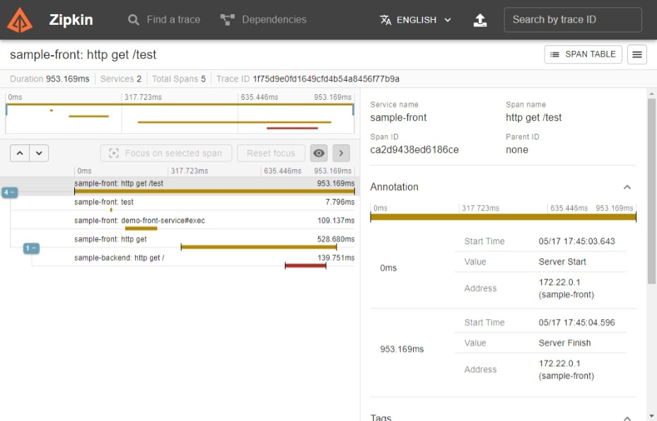

# トレースについて調べるやつ

- [トレースについて調べるやつ](#トレースについて調べるやつ)
	- [overview](#overview)
	- [起動の仕方](#起動の仕方)
		- [1. devcontainerで環境を立ち上げる](#1-devcontainerで環境を立ち上げる)
		- [2. elastic stackをcomposeで起動する](#2-elastic-stackをcomposeで起動する)
		- [3. アプリケーションを起動する](#3-アプリケーションを起動する)
		- [4. アクセスしてみる](#4-アクセスしてみる)
	- [zipkin](#zipkin)
	- [traceの実装方法](#traceの実装方法)
		- [web serverのendpointのspan](#web-serverのendpointのspan)
		- [アノテーションベースのspan](#アノテーションベースのspan)
		- [動的にspanを作成する](#動的にspanを作成する)
	- [参考資料](#参考資料)

## overview

トレースの動きを調べるためにいろいろ試すためのやつ。

前提として、vscodeでdevcontainerを使って、環境を作成し、 docker composeで起動した zipkin に対してtrace情報を詰め込むようにしている。


## 起動の仕方

### 1. devcontainerで環境を立ち上げる

``` powershell
PS> devcontainer open .
```

### 2. elastic stackをcomposeで起動する

``` bash
$ docker compose up -d
```

### 3. アプリケーションを起動する

vscodeの spring boot dashboard から一括起動


### 4. アクセスしてみる

http://localhost:8080/test を開く

## zipkin

zipkinにアクセスするとトレース情報が見える。



## traceの実装方法

### web serverのendpointのspan

通常通り `@RestController` で作られている場合、特に何もしていない状態でSpanが作成される。

### アノテーションベースのspan

spring boot 2.x.x の時のtraceと違う指定方法となる。

前提条件として以下のような状況にする。

* 依存に `spring-aspect` が存在する。
* `ObservedAspect` がBean登録されている。

この状態で、 `@Observied(name = "span name")` をpublic functionにつけることで新たなspanが作成される。  
つまり、元の `@NewSpan` と同等と考えてよい。

``` java
	@Bean
	ObservedAspect observedAspect(ObservationRegistry observationRegistry) {
		return new ObservedAspect(observationRegistry);
	}
```

``` java
	@Service
	@Slf4j
	public static class DemoFrontService {

		@Observed(name = "service function")
		public String exec() {
			try {
				TimeUnit.MILLISECONDS.sleep(100L);
				log.info("service test");
			} catch (InterruptedException e) {
				throw new RuntimeException(e);
			}
			return "OK";
		}
	}
```

### 動的にspanを作成する

`Trace` からspanを作成していたが、 `Observation` から `createNotStarted` でspanを作成する。

micrometerの場合は最初からfluentなI/Fで作成作成されているため、以下のように定義できる。

``` java

	@RestController
	@Slf4j
	public static class DemoFrontController {
		:
		private final ObservationRegistry registry;
		:
        :
		:
		:

		@GetMapping(value="/test")
		public String getMethodName() {
			Observation.createNotStarted("test", registry)
				.observe(() -> log.info("test"));
			service.exec();
			return restTemplate.getForObject(backendUrl, String.class);
		}
		
	}
```

## 参考資料

https://docs.spring.io/spring-boot/docs/3.0.5/reference/htmlsingle/#actuator.micrometer-tracing
