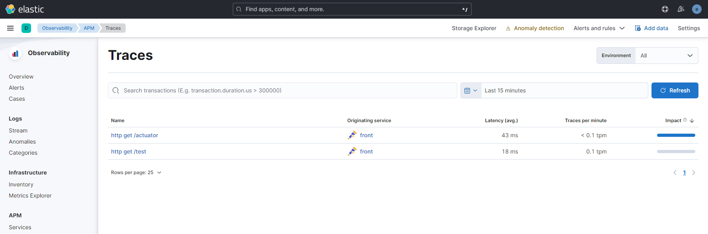
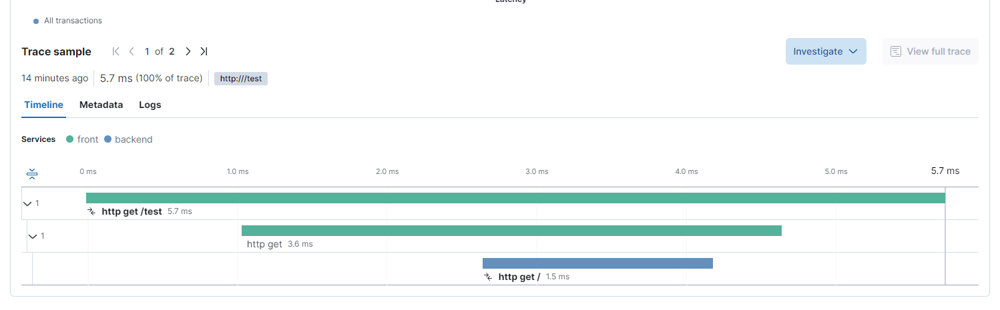

# トレースについて調べるやつ

## overview

トレースの動きを調べるためにいろいろ試すためのやつ。

前提として、vscodeでdevcontainerを使って、環境を作成し、 docker composeで起動した elastic stack に対してtrace情報を詰め込むようにしている。


## 起動の仕方

### 1. devcontainerで環境を立ち上げる

``` powershell
PS> devcontainer open .
```

### 2. elastic stackをcomposeで起動する

``` bash
$ docker compose up -d
```

### 3. アプリケーションを起動する

vscodeの spring boot dashboard から一括起動


### 4. アクセスしてみる

http://localhost:8080/test を開く

## kibanaの見た目

kibanaのAPMのtraceを見ることで、トレース情報を参照することができる。





## 参考資料

https://docs.spring.io/spring-boot/docs/3.0.5/reference/htmlsingle/#actuator.micrometer-tracing