# トレースについて調べるやつ

## overview

トレースの動きを調べるためにいろいろ試すためのやつ。

そのまま使って、openobserveを試したもの。



## 起動の仕方

### 1. devcontainerで環境を立ち上げる

``` powershell
PS> devcontainer open .
```

### 2. openobserveだけをいったん立ち上げる

``` bash
$ docker compose up -d openobserve
```

### 3. openobservveの画面から認証情報を取得

※ ID/PASSは `root@example.com/openobserve`


各種設定ファイルに転記

* Logs
  * `./backend/src/main/resources/log4j2-spring.xml`
  * `./front/src/main/resources/log4j2-spring.xml`
* Metrics
  * `./dev/docker/prometheus/prometheus.yml`
* Traces
  * `./backend/src/main/resources/application.yml`
  * `./front/src/main/resources/application.yml`

### 4. 残りのコンテナを立ち上げる

``` bash
$ docker compose up -d
```

### 5. アプリケーションを起動する

vscodeの spring boot dashboard から一括起動


### 4. アクセスしてみる

http://localhost:8080/test を開く

## openobserveの見た目

openobserveでは、Logs/Metrics/Traceを一か所で見れる。


## 参考資料

* https://openobserve.ai/docs/quickstart/
* https://logging.apache.org/log4j/2.x/manual/layouts.html#JSONLayout
* https://logging.apache.org/log4j/2.x/manual/json-template-layout.html
* https://prometheus.io/docs/practices/remote_write/